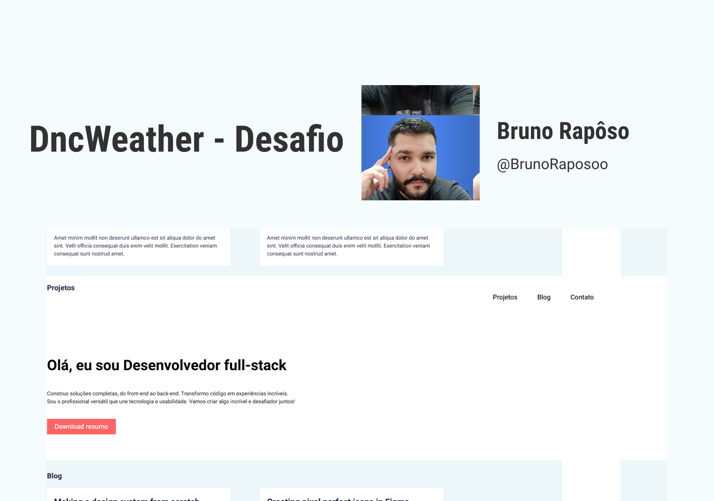

<h1 align="center"> Desafio 3 - Portfólio 📓</h1>

  <a href="#-tecnologias">Tecnologias</a>&nbsp;&nbsp;&nbsp;|&nbsp;&nbsp;&nbsp;
  <a href="#-projeto">Projeto</a>&nbsp;&nbsp;&nbsp;|&nbsp;&nbsp;&nbsp;
  <a href="#-layout">Layout</a>&nbsp;&nbsp;&nbsp

 

  

## 🚀 Tecnologias

Esse projeto foi desenvolvido com as seguintes tecnologias:

- [ReactJS](https://react.dev/)
- [CSS](https://developer.mozilla.org/pt-BR/docs/Learn/Getting_started_with_the_web/CSS_basics)

## 💻 Projeto

Projeto desenvolvido para criar um site portfólio no desafio 3 da escola DNC.    
Para acessar o projeto clique [AQUI]()  
Ou acesse o site 

## 🔖 Layout

Você pode visualizar o layout do projeto através [DESSE LINK](https://www.figma.com/file/O2j7uVVhXUnV6dadZc2MMw/Desafio-03%3A-Desenvolva-um-portf%C3%B3lio-com-React-hooks?type=design&node-id=1-447&mode=design&t=s96t0Ao2Zc0J7lbO-0). É necessário ter conta no [Figma](https://figma.com) para acessá-lo.